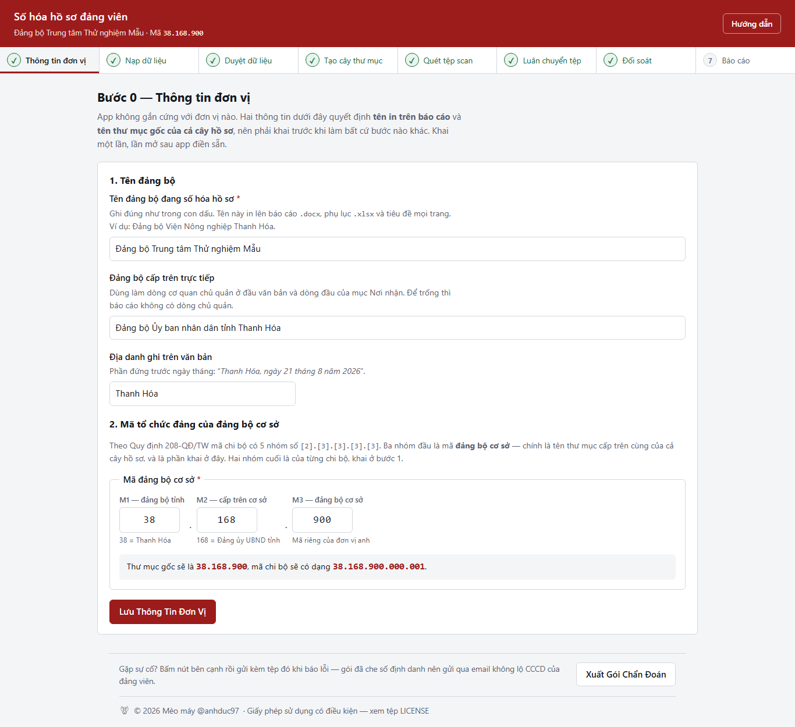

# Số hóa hồ sơ đảng viên

Ứng dụng web **chạy cục bộ trên một máy**, giúp tổ số hóa của một đảng bộ cơ sở
lập cây thư mục, đặt tên tệp, luân chuyển bản scan và đối soát tiến độ hồ sơ
đảng viên — theo Quy định 208-QĐ/TW, Nghị định 30/2020/NĐ-CP và Thông tư
02/2019/TT-BNV.

Không cần máy chủ, không cần cơ sở dữ liệu, **không gửi gì ra Internet**.



---

## App làm được gì

Tám bước, làm tuần tự, bước sau chỉ mở khi bước trước xong:

| Bước | Việc | Ghi lên đĩa |
| :--- | :--- | :--- |
| **0** | Khai tên và mã tổ chức của đảng bộ | `app/data/cau_hinh.json` |
| **1** | Đọc `DS_DANGVIEN.xlsx`, dựng bảng chi bộ, cấp mã `ID` | — |
| **2** | Duyệt bảng đối chiếu rồi ghi sổ cái | `MAIN.xlsx` (19 cột, 5 bản sao lưu) |
| **3** | Tạo cây thư mục 4 cấp, kiểm ngân sách 260 ký tự của Windows | thư mục rỗng |
| **4** | Quét thư mục scan, chấm lỗi `E01`–`E07`, cảnh báo `W01`–`W02` | — |
| **5** | Đặt tên chuẩn và **chép** vào kho, so trùng bằng SHA-256 | tệp + `manifest_*.csv` |
| **6** | Đối soát 104 loại tài liệu, tính tiến độ theo 3 mức ưu tiên | 6 cột trong `MAIN.xlsx` |
| **7** | Xuất báo cáo `.docx` đúng thể thức + phụ lục `.xlsx` 3 sheet | 2 tệp báo cáo |

Ba nguyên tắc xuyên suốt:

1. **Chỉ chép, không bao giờ đụng tệp gốc.** Chạy sai thì xóa kho, chạy lại.
2. **Xem trước rồi mới thực thi.** Mọi bước ghi đĩa đều có nút xem trước riêng,
   và xem trước không ghi một byte nào.
3. **Không đoán thay người dùng.** Gặp mâu thuẫn thì dừng và báo, không tự gộp,
   không tự ghi đè.

---

## Không khóa cứng vào một đơn vị

Tên đảng bộ và mã tổ chức đảng **chỉ có một nguồn duy nhất là bước 0**. Không có
tên hay mã của đơn vị nào được viết thẳng vào mã nguồn — có test chạy với một
đảng bộ hư cấu rồi soi cả tệp báo cáo xuất ra để bảo đảm điều đó.

Đơn vị mới dùng app chỉ cần:

1. Chép cả thư mục sang máy, chạy `install.bat`.
2. Mở app, khai **bước 0**: tên đảng bộ, đảng bộ cấp trên, địa danh, và mã đảng
   bộ cơ sở dạng `[2].[3].[3]`.
3. Nếu danh mục tài liệu khác: sửa `app/data/danh_muc_file.json`.

---

## Bản portable — khuyến nghị cho máy không có mạng

Không cần cài Python, không cần Internet, không cần `git clone`. Tải tệp zip
đã đóng gói sẵn (mang theo cả Python 3.14 64-bit + toàn bộ thư viện) tại:

**[Trang Releases](https://github.com/BonBeovnn/so-hoa-ho-so-dang-vien/releases/tag/portable-v1.0.0)**
— tệp `SoHoa_HoSoDangVien_Portable_v1.0.0.zip` (~20 MB).

Cách dùng: chép sang máy đích bằng USB, giải nén toàn bộ, bấm đúp
`start.bat`. Chi tiết trong `DOC_TRUOC_KHI_CHAY.txt` nằm trong tệp zip.

Bản này thay thế cách đóng gói `.exe` (PyInstaller) ở mục dưới — mã nguồn để
ở dạng rõ ràng thay vì nén thành 1 tệp nhị phân, nên tránh được cảnh báo nhầm
virus (Bkav, Windows Defender) mà `.exe` PyInstaller chưa ký số hay gặp.

---

## Cài đặt (chạy từ mã nguồn)

Yêu cầu: **Windows** + **Python 3.14 64-bit** (bản đóng gói ngoại tuyến gắn với
đúng phiên bản này; cài từ mạng thì phiên bản 3.11 trở lên đều chạy).

```bat
install.bat      :: lần đầu trên mỗi máy
start.bat        :: mọi lần sau — trình duyệt tự mở
```

Cài thủ công:

```bat
python -m venv .venv
.venv\Scripts\python.exe -m pip install -r requirements.txt
.venv\Scripts\python.exe -m uvicorn app.main:app --host 127.0.0.1 --port 8000
```

Cửa sổ dòng lệnh in ra địa chỉ kèm **mã phiên** — phải mở đúng địa chỉ đó, vì
mọi trang đều đòi mã phiên.

---

## Đóng gói thành 1 tệp .exe (cách cũ, đã thay bằng bản portable ở trên)

Cách "Cài đặt" trên vẫn đòi máy đích có đúng Python 3.14 64-bit. Cách này từng
dùng để phát cho máy không chắc có Python, đóng gói bằng
[PyInstaller](https://pyinstaller.org/) thành một tệp `.exe` duy nhất, mang
theo cả trình thông dịch Python:

```bat
packaging\build.bat
```

Lần đầu script tự cài `pyinstaller` (và `svglib`/`reportlab`/`pillow` để dựng
biểu tượng màu đỏ từ `app/static/img/meo-may.svg` nếu `packaging\icon.ico`
chưa có) — cần mạng cho đúng một lần này. Kết quả nằm ở
`packaging\dist\SoHoa_HoSoDangVien.exe` (~28 MB), copy riêng tệp đó sang máy
khác là chạy được, hành vi giống hệt `start.bat`: tự mở trình duyệt, in địa
chỉ kèm mã phiên ra cửa sổ dòng lệnh, giữ nguyên ba lớp bảo vệ dữ liệu cá nhân
ở mục dưới.

Khác biệt duy nhất cần nhớ: bản `start.bat` ghi `app/data/` cạnh mã nguồn; bản
`.exe` ghi một thư mục `data/` cạnh chính tệp `.exe` đó (xem
`app/core/paths.py::thu_muc_du_lieu()`), vì PyInstaller giải nén mã nguồn vào
thư mục tạm rồi xóa sạch mỗi khi thoát — ghi vào đó thì mất hết dữ liệu qua
mỗi lần chạy.

### Nếu bị báo nhầm virus

Tệp `.exe` **không ký số** (chưa mua chứng chỉ Authenticode), nên vài phần
mềm diệt virus dùng **mô hình máy học** để đoán tệp lạ — đặc biệt Bkav và
Windows Defender (`Trojan:Win32/Wacatac.B!ml` — hậu tố `.ml` nghĩa là "machine
learning", tức đoán chứ không khớp mẫu virus cụ thể nào) — có thể báo nhầm.
Đây là vấn đề đã biết của **mọi** ứng dụng PyInstaller `--onefile` chưa ký số,
không riêng gì app này: tệp có hình dạng "một đoạn mã nhỏ + khối nén dữ liệu
lớn, entropy cao, tự giải nén ra thư mục tạm lúc chạy" — đúng hình dạng máy
học coi là đáng ngờ, bất kể bên trong thật sự làm gì.

Cách tự kiểm chứng:

1. Xem ở [VirusTotal](https://www.virustotal.com/) mục **Behavior**: app không
   có `Network comms`, không có `Dropped Files` tồn tại sau khi thoát (những
   tệp `.pyd`/`.dll` ghi vào `%TEMP%` khi chạy đều tự xóa khi tắt — đó là
   PyInstaller giải nén thư viện, không phải phần mềm gián điệp cài lại).
2. Mã nguồn ở kho này công khai — đọc trực tiếp `app/main.py` và
   `app/core/*.py`, không có dòng nào gọi mạng ra ngoài `127.0.0.1`.

Nếu Bkav hoặc phần mềm của cơ quan **chặn hẳn** việc chạy (không chỉ cảnh báo
lúc tải về):

* Đóng gói lại thành **thư mục** thay vì 1 tệp — thường ít bị báo nhầm hơn vì
  không có bước tự giải nén vào thư mục tạm lúc khởi động:
  ```bat
  packaging\build.bat onedir
  ```
  Kết quả ở `packaging\dist_onedir\SoHoa_HoSoDangVien\` — chép cả thư mục.
* Hoặc quay lại cách chạy bằng `install.bat` + `start.bat` (không đóng gói) —
  chưa ghi nhận trường hợp nào bị báo nhầm.
* Gửi báo cáo false positive để nhà cung cấp đối chiếu và bỏ chặn: Microsoft
  tại [Windows Defender Security
  Intelligence](https://www.microsoft.com/en-us/wdsi/filesubmission), Bkav
  qua trang hỗ trợ [bkav.com.vn](https://www.bkav.com.vn/).

---

## Chạy test

```bat
.venv\Scripts\python.exe -m pytest -q
```

Chụp lại toàn bộ ảnh màn hình trong tài liệu (cần Chrome hoặc Edge):

```bat
.venv\Scripts\python.exe scripts\chup_anh.py
```

Script tự dựng dữ liệu giả, tự trả template và cấu hình về nguyên trạng khi
xong — không bao giờ chụp dữ liệu thật.

---

## Bảo vệ dữ liệu cá nhân

Hồ sơ đảng viên chứa số căn cước và ngày sinh. Bốn lớp bảo vệ dựng sẵn:

1. Máy chủ **chỉ lắng nghe `127.0.0.1`** — máy khác trong mạng không truy cập được.
2. Mọi trang và API đòi **token phiên sinh ngẫu nhiên lúc khởi động**, nên một
   trang web độc hại mở ở tab khác không gọi được API dù cùng máy.
3. Nhật ký **che mọi dãy 9–12 chữ số** trước khi ghi.
4. Gói chẩn đoán che số định danh một lần nữa, và không chứa nội dung hồ sơ.

`/docs`, `/redoc` và `/openapi.json` đều tắt.

> ⚠️ **Không bao giờ commit thư mục `app/data/`.** Nó chứa `manifest_*.csv` với
> đường dẫn đích, mà tên thư mục đảng viên có số căn cước trong đó. `.gitignore`
> đã chặn sẵn — đừng dùng `git add -f` để lách.

---

## Cấu trúc mã nguồn

```
app/
  main.py            định tuyến web, xác thực token, hợp đồng API
  core/
    phien.py         trạng thái phiên + cấu hình đơn vị (bước 0)
    mainbook.py      đọc DS_DANGVIEN, dựng và ghi sổ cái MAIN.xlsx
    tree.py          lập kế hoạch và tạo cây thư mục 4 cấp
    intake.py        quét, chấm lỗi, lập kế hoạch và luân chuyển tệp scan
    rename.py        quy tắc đặt tên tệp đích
    audit.py         đối soát 104 loại tài liệu, tính tiến độ
    report.py        xuất .docx theo thể thức + phụ lục .xlsx
    vietnamese.py    bỏ dấu, chuẩn hóa mã tổ chức đảng
    paths.py         ngân sách độ dài đường dẫn, chọn thư mục
    nhat_ky.py       nhật ký có che số định danh
    chan_doan.py     gói chẩn đoán .zip
    ban_quyen.py     thông tin tác giả dùng chung
  templates/         Jinja2, không framework front-end
  static/            CSS và JavaScript thuần, không thư viện ngoài
tests/               421 test
docs/                hướng dẫn vận hành + ảnh chụp màn hình
scripts/             tiện ích bảo trì
packaging/           đóng gói thành 1 tệp .exe — xem mục "Đóng gói" ở trên
```

Chú thích trong mã viết bằng tiếng Việt và giải thích **vì sao** chứ không phải
*làm gì*. Vài chú thích có nhắc tới tài liệu đặc tả nội bộ (`0.DACTA_CHOT_v1.md`,
`1.Dacta_fixV1`) không đi kèm kho này — giữ lại để không mất dấu vết vì sao một
quyết định được chốt như vậy.

---

## Còn thiếu gì

App **chưa** ký số và **chưa** kiểm độ phân giải 200 dpi theo Thông tư
02/2019/TT-BNV; chưa tự chuyển `.doc`/ảnh sang PDF (xếp vào `_CHO_CHUYEN_PDF`);
chưa có OCR nhận diện mã tài liệu. Báo cáo xuất ra nói thẳng các hạn chế này
trong mục *Tồn tại, hạn chế* — đừng xóa mục đó.

---

## Giấy phép

© 2026 ([anhduc97](https://github.com/BonBeovnn)) — bảo lưu mọi quyền.

Mã nguồn công khai để đọc, kiểm chứng và chạy tại chỗ. **Đây không phải giấy
phép nguồn mở** theo định nghĩa của Open Source Initiative: được dùng và sửa
trong nội bộ cơ quan mình, **không** được phân phối lại hay dùng cho mục đích
thương mại nếu chưa có văn bản đồng ý của tác giả.

Chi tiết: [LICENSE](LICENSE) · [NOTICE.md](NOTICE.md)
