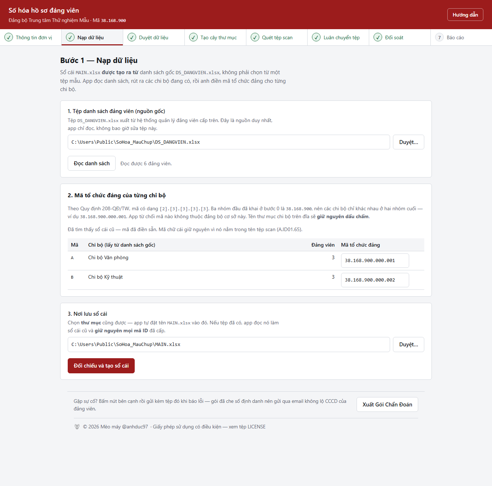
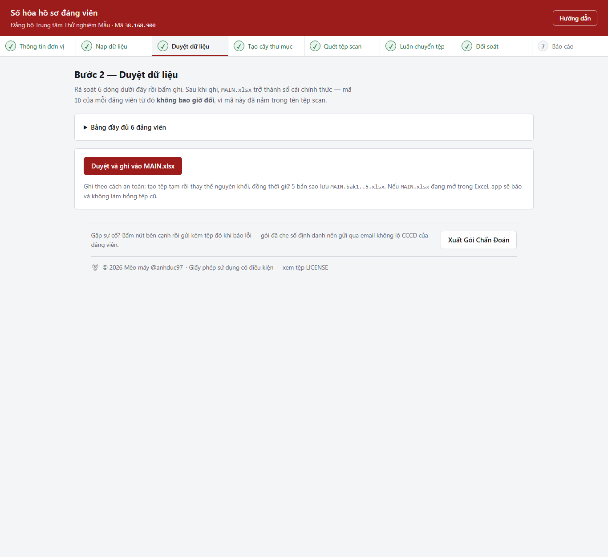
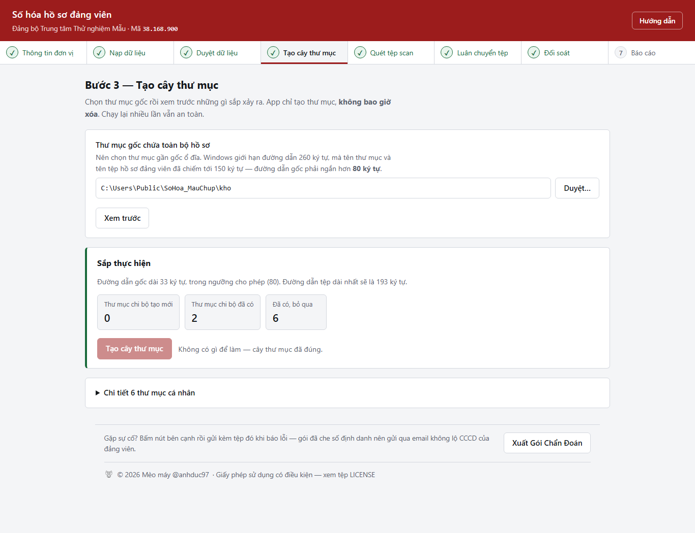
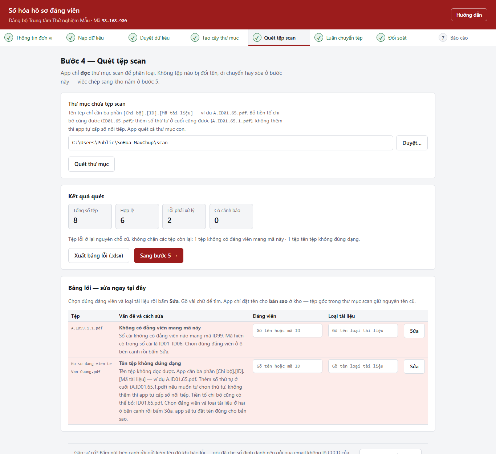
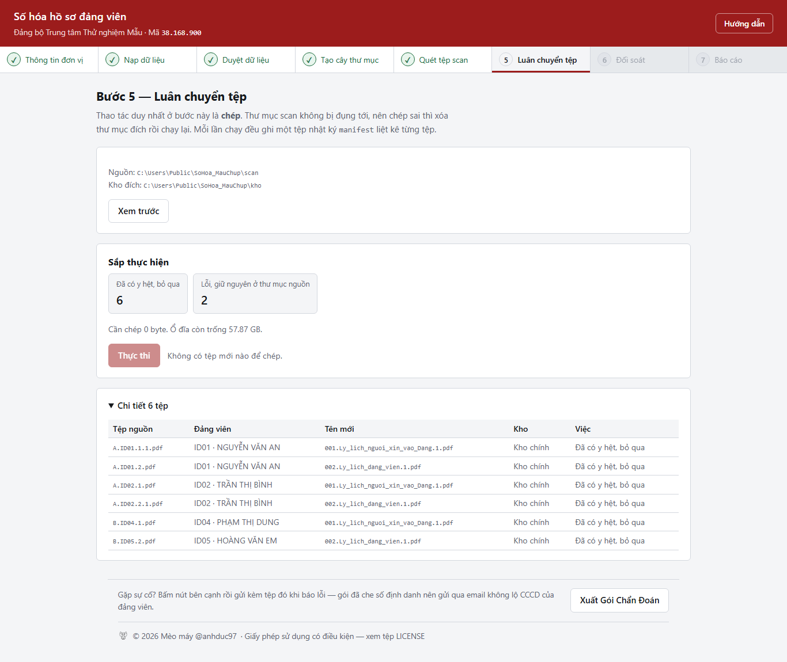
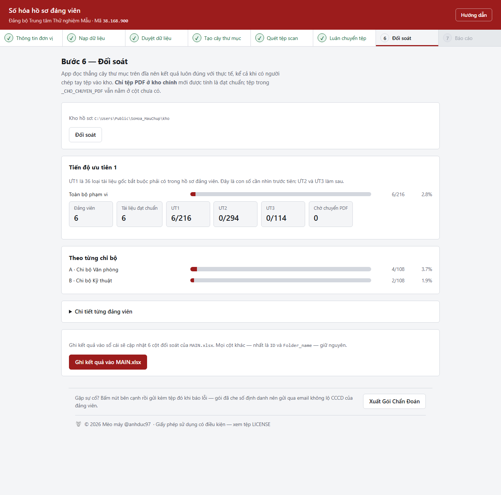
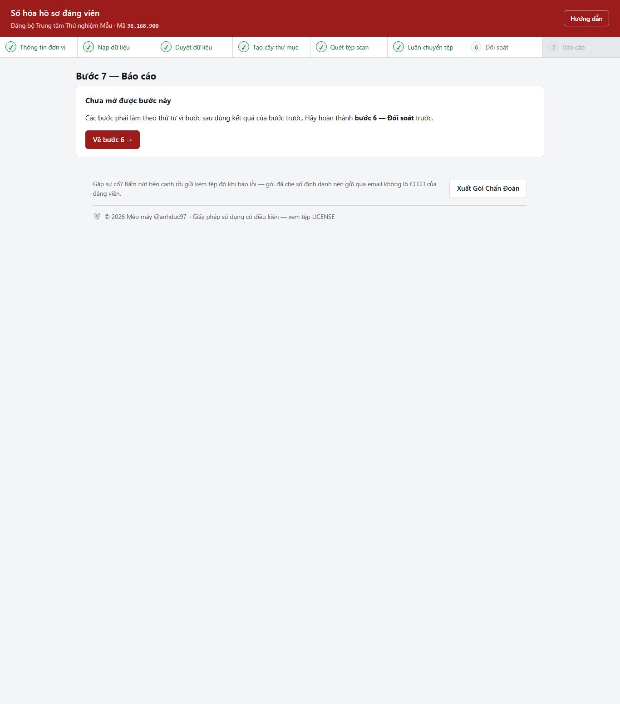

# Hướng dẫn vận hành — Ứng dụng số hóa hồ sơ đảng viên

Dành cho cán bộ Tổ số hóa. Không cần biết lập trình.

Ảnh chụp trong tài liệu này dùng **dữ liệu giả 6 đảng viên của một đảng bộ hư
cấu** để minh họa — không phải số liệu thật của cơ quan nào. Chụp lại bằng
`.venv\Scripts\python.exe scripts\chup_anh.py`.

> Bản hướng dẫn này cũng có sẵn **ngay trong ứng dụng**: bấm nút **Hướng dẫn** ở
> góc trên bên phải mọi trang.

---

## Ba điều cần thuộc trước khi bắt đầu

**1. App không bao giờ xóa hay đổi tên tệp gốc của anh chị.** Thao tác duy nhất
với thư mục scan là *chép ra*. Chạy sai thì xóa thư mục kho rồi chạy lại, bản
scan gốc vẫn còn nguyên.

**2. Cửa sổ đen là ứng dụng.** Đóng cửa sổ đen (cửa sổ dòng lệnh) là tắt app.
Cứ để nó chạy suốt buổi làm việc, thu nhỏ xuống thanh tác vụ cũng được.

**3. Bước sau chỉ mở khi bước trước xong.** Thanh 8 bước ở đầu trang cho biết
đang ở đâu: dấu ✓ là đã xong, số mờ là chưa mở được. Bắt đầu ở **bước 0**.

---

## Cài đặt và khởi động

| Lần | Làm gì |
| :--- | :--- |
| Lần đầu trên một máy | Bấm đúp `install.bat`, chờ tới khi hiện *"Cài đặt xong"* |
| Mọi lần sau | Bấm đúp `start.bat`, trình duyệt tự mở |

Máy không có mạng vẫn cài được: thư mục `vendor` đã chứa sẵn thư viện. Đọc
`vendor\DOC_TOI.txt` nếu máy đích dùng phiên bản Python khác 3.14 64-bit.

Nếu trình duyệt báo **"Phiên không hợp lệ"**: quay lại cửa sổ đen, chép dòng địa
chỉ `http://127.0.0.1:8000/...` rồi dán vào trình duyệt. Mỗi lần khởi động app
sinh một mã phiên mới, nên địa chỉ cũ lưu trong dấu trang sẽ không dùng lại được.

---

## Bước 0 — Thông tin đơn vị


Làm **một lần** cho mỗi đơn vị. App không gắn cứng với đảng bộ nào, nên phải
khai trước khi làm bất cứ bước nào khác.

| Ô | Ghi gì | Dùng vào việc gì |
| :--- | :--- | :--- |
| Tên đảng bộ | Đúng như trong con dấu | Tên in trên báo cáo, phụ lục và tiêu đề mọi trang |
| Đảng bộ cấp trên | Đảng bộ cấp trên trực tiếp | Dòng cơ quan chủ quản và dòng đầu mục *Nơi nhận* |
| Địa danh | Tỉnh, thành nơi ban hành văn bản | Phần đứng trước ngày tháng trong báo cáo |
| Mã đảng bộ cơ sở | Ba nhóm số `[2].[3].[3]` | **Tên thư mục cấp trên cùng của cả cây hồ sơ** |

**Mã đảng bộ cơ sở** là ba nhóm số đầu của mã tổ chức đảng theo Quy định
208-QĐ/TW:

* `38` — mã đảng bộ tỉnh. Điền sẵn Thanh Hóa, đơn vị tỉnh khác sửa lại.
* `168` — mã đảng bộ cấp trên trực tiếp cơ sở. Điền sẵn Đảng ủy UBND tỉnh.
* nhóm thứ ba — **mã riêng của đơn vị**, chỗ bắt buộc phải tự điền.

Ô xem trước ngay dưới ba ô nhập cho thấy đúng chuỗi sắp thành tên thư mục.

> **Đổi mã đảng bộ cơ sở sau khi đã tạo cây là đổi gốc cây.** App tự xóa dấu
> hoàn thành của các bước sau và bắt làm lại từ bước 1. Cây cũ trên đĩa vẫn còn
> nguyên, anh chị tự quyết định giữ hay xóa.

---

## Bước 1 — Nạp dữ liệu



1. Chọn tệp `DS_DANGVIEN.xlsx` do hệ thống quản lý đảng viên cấp trên xuất ra.
2. Bấm **Đọc danh sách**. App rút ra các chi bộ đang có trong chính tệp đó.
3. Điền **mã tổ chức đảng** cho từng chi bộ — mã do đảng ủy cấp trên cấp, dạng
   `38.168.053.000.001`. Chạy lần sau app điền sẵn, không phải gõ lại.
   Ba nhóm số đầu phải **đúng bằng mã đảng bộ cơ sở đã khai ở bước 0**; app từ
   chối mã lệch, vì sai một chữ số ở nhóm giữa là cả chi bộ bị đẩy sang một cây
   thư mục khác mà không ai nhận ra cho tới khi tệp đã chép vào sai chỗ.
4. Chọn nơi lưu sổ cái rồi bấm **Đối chiếu và tạo sổ cái**.

> Ô "nơi lưu sổ cái" nhận cả **thư mục** — app tự đặt tên `MAIN.xlsx` vào trong.

**Sổ cái `MAIN.xlsx` là gì:** nơi app nhớ mã `ID01`…`ID85` của từng đảng viên.
Mã này **không bao giờ đổi**, kể cả khi người đó chuyển chi bộ hay đổi tên, vì
nó đã nằm trong tên tệp scan (`A.ID01.65.pdf`). Đổi ID là hỏng toàn bộ dữ liệu
đã scan.

---

## Bước 2 — Duyệt dữ liệu



Mở bảng ra xem trước rồi mới bấm **Duyệt và ghi vào MAIN.xlsx**.

Bảng có thể báo hai loại việc cần xem:

* **Dòng cần sửa** — dữ liệu trong sổ cái cũ khác với dữ liệu app tính ra. Hay
  gặp nhất là tên thư mục sai chuẩn. App sẽ đổi tên thư mục ở bước 3 mà không
  làm mất tệp bên trong.
* **Cảnh báo** — đảng viên thiếu số CCCD và số thẻ đảng viên. App vẫn tạo thư
  mục (chỉ có tên), không chặn tiến độ.

> Nếu `MAIN.xlsx` đang mở trong Excel, app sẽ báo và **không** làm hỏng tệp cũ.
> Đóng Excel rồi bấm lại.

---

## Bước 3 — Tạo cây thư mục



Chọn thư mục gốc rồi bấm **Xem trước** — app cho xem sắp tạo bao nhiêu thư mục,
đổi tên những thư mục nào. Xem xong mới bấm **Tạo cây thư mục**.

Cây có 4 cấp:

```
D:\SoHoa\HSDV\
└── 38.168.053\                          đảng bộ cơ sở — lấy từ bước 0
    └── 38.168.053.000.001\              chi bộ — lấy từ bảng ở bước 1
        └── 099001110001_NguyenVanA\     đảng viên — số CCCD _ họ tên không dấu
```

**Thư mục gốc phải ngắn.** Windows chỉ cho đường dẫn dài 260 ký tự, mà tên thư
mục và tên tệp hồ sơ đã chiếm gần 165 ký tự. App chặn nếu thư mục gốc dài quá
80 ký tự. Nên chọn `D:\SoHoa\HSDV` chứ đừng để trong `Documents\...`.

Chạy lại bước này nhiều lần vẫn an toàn: thư mục đã có thì bỏ qua.

---

## Bước 4 — Quét tệp scan



Chọn thư mục chứa tệp scan rồi bấm **Quét thư mục**. App chỉ *đọc*, chưa chép gì.

### Tên tệp scan phải đặt thế nào

Chỉ cần **ba phần**. Hậu tố số thứ tự ở cuối là *tùy chọn*:

```
[Chi bộ].[ID đảng viên].[Mã tài liệu].pdf                 A.ID01.65.pdf     ← đủ dùng
[Chi bộ].[ID đảng viên].[Mã tài liệu].[Số thứ tự].pdf     A.ID01.65.1.pdf
[ID đảng viên].[Mã tài liệu].pdf                          ID01.65.pdf
[ID đảng viên].[Mã tài liệu].[Số thứ tự].pdf              ID01.65.1.pdf
```

* **Chi bộ** — chữ cái A…G, có cũng được không có cũng được. Có thì app kiểm tra
  chéo với chi bộ thật của người đó.
* **ID đảng viên** — bắt buộc. Tra ở sheet `DSTTHC` trong `MAIN.xlsx`.
* **Mã tài liệu** — bắt buộc. Số từ 1 đến 104, tra ở sheet `DANH_MUC_FILE`.
* **Số thứ tự** — **không bắt buộc.** Có thì app cấp số theo đúng thứ tự người
  scan đã khai; không có thì app tự cấp số nối tiếp. Hai tệp cùng mã trong một
  thư mục thì chính Windows đã bắt đổi tên ngay lúc lưu, nên không cần phần này
  để phân biệt.
* Đuôi nhận: `.pdf` `.doc` `.docx` `.jpg` `.jpeg` `.png`

> Đặt tên đủ bốn phần vẫn đúng như trước, không phải đổi lại tệp đã scan.

### Bảng lỗi sửa được ngay tại chỗ

Tệp sai tên **ở lại nguyên chỗ cũ**, không chặn các tệp còn lại. Với mỗi dòng
lỗi, chọn đúng đảng viên và loại tài liệu ở hai ô bên cạnh (gõ vài chữ để tìm)
rồi bấm **Sửa** — app đặt tên đúng cho **bản sao** ở kho, tệp gốc trong thư mục
scan giữ nguyên tên cũ.

Bấm **Xuất bảng lỗi (.xlsx)** để mang danh sách đi đối chiếu với người scan.

---

## Bước 5 — Luân chuyển tệp



Bấm **Xem trước** để xem từng tệp sẽ đi đâu, mang tên gì. Xem xong bấm
**Thực thi**.

Tên tệp đích do app đặt theo Kế hoạch số hóa:

```
065.Ban_tu_kiem_diem_dang_vien_vi_pham.1.pdf
│   │                                   └── số thứ tự, đếm tiếp từ tệp đã có
│   └── tên loại tài liệu, tra từ danh mục 104 loại
└── mã tài liệu, đệm đủ 3 chữ số
```

**Tệp không phải PDF** vẫn được đổi tên đúng chuẩn nhưng xếp riêng vào thư mục
`_CHO_CHUYEN_PDF` trong thư mục của đảng viên đó, vì Thông tư 02/2019/TT-BNV yêu
cầu tài liệu lưu trữ số phải ở dạng PDF.

**Chạy lại nhiều lần không nhân bản tệp.** App so nội dung tệp (không so tên)
nên tệp đã chép rồi thì lần sau bỏ qua im lặng.

Mỗi lần chạy ghi một tệp nhật ký `manifest_<ngày giờ>.csv` trong `app\data`,
liệt kê từng tệp đi từ đâu tới đâu — mở bằng Excel xem được.

---

## Bước 6 — Đối soát



Bấm **Đối soát**. App đọc thẳng cây thư mục trên đĩa nên kết quả luôn đúng với
thực tế, kể cả khi có người chép tay tệp vào kho.

**Con số cần nhìn là ƯT1** — 36 loại tài liệu gốc bắt buộc phải có trong hồ sơ.
ƯT2 (49 loại) và ƯT3 (19 loại) làm sau.

> Chỉ tệp **PDF ở kho chính** mới tính là đạt chuẩn. Tệp trong `_CHO_CHUYEN_PDF`
> vẫn nằm ở cột *chưa có* cho tới khi được chuyển sang PDF.

Bấm **Ghi kết quả vào MAIN.xlsx** để cập nhật 6 cột đối soát trong sổ cái. Các
cột khác — nhất là `ID` và `Folder_name` — giữ nguyên.

---

## Bước 7 — Báo cáo



Chọn phạm vi (toàn Đảng bộ hoặc một chi bộ), điền phần thể thức rồi bấm
**Xuất báo cáo**. App tạo hai tệp:

* `BaoCao_SoHoaHSDV_....docx` — báo cáo đúng thể thức, mở bằng Word sửa lời văn
  trước khi trình ký.
* `PhuLuc_SoHoaHSDV_....xlsx` — 3 sheet: tổng hợp theo chi bộ, chi tiết từng
  đảng viên, và **danh sách tài liệu ƯT1 còn thiếu của từng người** (mang đi giao
  việc cho các chi bộ).

Báo cáo dùng thể thức văn bản của Đảng (`ĐẢNG CỘNG SẢN VIỆT NAM`, `Số ..-BC/ĐU`,
`T/M ĐẢNG ỦY`). Cần bản thể thức nhà nước thì đổi ô **Kiểu tiêu đề**.

**Mục "Tồn tại, hạn chế" nói rõ phần chưa đạt:** tài liệu chưa ký số, chưa kiểm
độ phân giải 200 dpi theo Thông tư 02/2019/TT-BNV. Đừng xóa mục này — nó tránh
cho cấp trên hiểu nhầm là đã số hóa xong theo chuẩn lưu trữ.

---

## Khi gặp sự cố

Ở **mọi trang** đều có nút **Xuất gói chẩn đoán** ở cuối trang. Bấm nút đó rồi
gửi kèm tệp `.zip` tải về khi báo lỗi.

Gói này chứa: phiên bản Python và thư viện, đường dẫn đang dùng, tóm tắt trạng
thái từng bước, nhật ký chạy, manifest gần nhất. **Mọi dãy 9–12 chữ số đều đã bị
che** nên gửi qua email không lộ số CCCD của đảng viên.

### Vài tình huống hay gặp

| Hiện tượng | Nguyên nhân và cách xử lý |
| :--- | :--- |
| "Không liên lạc được với ứng dụng" | Cửa sổ đen đã bị đóng. Chạy lại `start.bat`. |
| "Phiên không hợp lệ" | Địa chỉ cũ, mã phiên đã đổi. Lấy địa chỉ mới ở cửa sổ đen. |
| "Tệp có thể đang mở trong Excel" | Đóng Excel rồi bấm lại. Tệp cũ không bị hỏng. |
| "Đây là thư mục chứ không phải tệp" | Bấm **Duyệt** rồi chọn đúng tệp `.xlsx`. |
| "Thư mục gốc vượt ngưỡng" | Chọn thư mục gần gốc ổ đĩa, ví dụ `D:\SoHoa\HSDV`. |
| Quét ra toàn lỗi `Tên tệp không đúng dạng` | Người scan chưa đặt tên theo quy tắc ở bước 4. |
| "Mã chi bộ không thuộc đảng bộ cơ sở" | Ba nhóm số đầu của mã chi bộ lệch với mã khai ở bước 0. Sửa bảng ở bước 1, hoặc sửa bước 0 nếu chính chỗ đó gõ nhầm. |
| Bước 1 bị khóa, không bấm vào được | Chưa làm bước 0. Về bước 0 khai tên và mã đảng bộ. |

---

## Câu hỏi thường gặp

**App có gửi dữ liệu đi đâu không?** Không. App chỉ lắng nghe trên chính máy này
(`127.0.0.1`), máy khác trong mạng cơ quan không truy cập được.

**Chạy lại từ đầu có mất gì không?** Không. Cây thư mục đã có thì bỏ qua, tệp đã
chép thì bỏ qua theo nội dung, mã `ID` giữ nguyên vĩnh viễn.

**Lỡ chép sai thì sao?** Xóa thư mục kho rồi chạy lại bước 3 → 5. Thư mục scan
gốc chưa bao giờ bị đụng tới.

**Muốn kiểm tra máy vừa cài có chạy đúng không?** Mở cửa sổ đen tại thư mục app
và gõ `.venv\Scripts\python.exe -m pytest -q`. Tất cả phải xanh.

**Đơn vị khác dùng app này được không?** Được. Không có mã hay tên đơn vị nào
bị khóa cứng trong app. Chép cả thư mục sang máy khác, chạy `install.bat`, rồi
khai lại **bước 0** với tên và mã đảng bộ của đơn vị đó. Danh mục 104 loại tài
liệu nằm ở `app\data\danh_muc_file.json`, sửa được nếu đơn vị dùng danh mục khác.

**Bản quyền phần mềm thuộc về ai?** Mèo máy (@anhduc97) — xem tệp `LICENSE` và
`NOTICE.md`. Cơ quan được dùng và sửa cho nội bộ; phân phối lại hay dùng cho mục
đích thương mại thì phải xin phép trước.

**Tệp `MAIN.xlsx` có mở bằng Excel để sửa tay được không?** Đọc thì thoải mái.
Sửa tay thì tránh — app ghi đè lại toàn bộ tệp mỗi lần chạy, nên công thức hay
định dạng tự thêm sẽ mất. App luôn giữ 5 bản sao lưu `MAIN.bak1..5.xlsx`.

---

## Bản quyền

**Số hóa hồ sơ đảng viên** — © 2026 **Mèo máy** (@anhduc97).
Phát hành theo giấy phép sử dụng có điều kiện, xem `LICENSE` và `NOTICE.md` ở
gốc thư mục ứng dụng.
